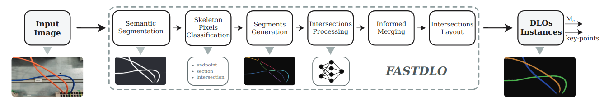

<div align="center">
<h2> FASTDLO: Fast Deformable Linear Objects Instance Segmentation </h2>

 :page_with_curl:  [IEEE Xplore](https://ieeexplore.ieee.org/document/9830852)  :page_with_curl:	
</div>


### Abstract
In this paper, an approach for fast and accurate segmentation of Deformable Linear Objects (DLOs) named FASTDLO is presented. A deep convolutional neural network is employed for background segmentation, generating a binary mask that isolates DLOs in the image. Thereafter, the obtained mask is processed with a skeletonization algorithm and the intersections between different DLOs are solved with a similarity-based network. Apart from the usual pixel-wise color-mapped image, FASTDLO also describes each DLO instance with a sequence of 2D coordinates, enabling the possibility of modeling the DLO instances with splines curves, for example. Synthetically generated data are exploited for the training of the data-driven methods, avoiding expensive collection and annotations of real data. FASTDLO is experimentally compared against both a DLO-specific approach and general-purpose deep learning instance segmentation models, achieving better overall performances and a processing rate higher than 20 FPS.


<h1 align="center">

### Installation

Main dependencies:

```
python (3.8)
pytorch (1.4.0)
opencv 
pillow 
scikit-image 
scipy 
shapely 
```

Installation (from inside the main project directory):
```
pip install .
```

### Models' weights

Download the [weights](https://drive.google.com/file/d/1OVcro53E_8oJxRPHqGy619rBNoCD3rzT/view?usp=sharing) and place them inside a ```weights``` folder.


### Usage

import as a standard python package with ```from fastdlo.core import Pipeline```.

Then initialize the class ``` p = Pipeline(checkpoint_siamese_network, checkpoint_segmentation_network) ```

the inference can be obtained with ```pred = p.run(source_img) ```.


### Acknowledgements/Fundings
This work was supported by the European Commission’s Horizon 2020 Framework
Programme with the project REMODEL - Robotic technologies for the manipulation of complex deformable linear objects - under grant agreement No 870133.

  
DeepLabV3+ implementation based on [https://github.com/VainF/DeepLabV3Plus-Pytorch](https://github.com/VainF/DeepLabV3Plus-Pytorch)

### Citation
If you use FASTDLO or this code base in your work, please cite
  
```
@ARTICLE{9830852,
  author={Caporali, Alessio and Galassi, Kevin and Zanella, Riccardo and Palli, Gianluca},
  journal={IEEE Robotics and Automation Letters}, 
  title={FASTDLO: Fast Deformable Linear Objects Instance Segmentation}, 
  year={2022},
  volume={7},
  number={4},
  pages={9075-9082},
  doi={10.1109/LRA.2022.3189791}}
```


